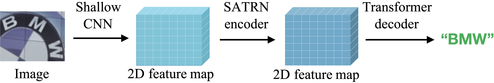
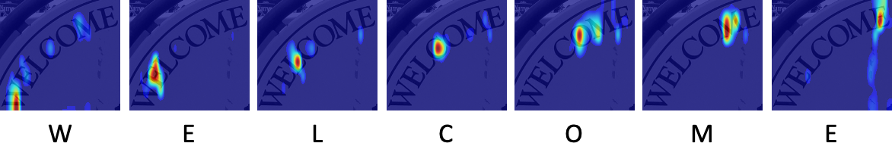
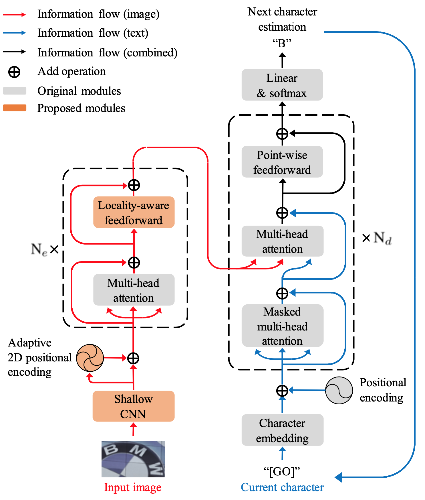

## On Recognizing Texts of Arbitrary Shapes with 2D Self-Attention
<p align="center">
  <br>
  
  <br>
  <b>Figure. Self-attention text recognition network(SATRN)</b>
</p>
<br>

<p align="center">
  
  <b>Figure. 2D attention map</b>
</p>

Official Tensorflow implementation of SATRN text recognizer | [Paper](https://openaccess.thecvf.com/content_CVPRW_2020/papers/w34/Lee_On_Recognizing_Texts_of_Arbitrary_Shapes_With_2D_Self-Attention_CVPRW_2020_paper.pdf) | [Pretrained Model](https://drive.google.com/file/d/1vRAVNiOQeKJZxmRgXWTS5e3hsAmPy5aG/view?usp=sharing) | Dataset | [PPT](https://drive.google.com/file/d/1bguKFWbtdm9hVZzjYsTcL_-JPBUXVBYL/view?usp=sharing)

**[Junyeop Lee](https://github.com/JunYeopLee), [Sungrae Park](https://github.com/sungraepark), Jeonghun Baek, Seong Joon Oh, Seonghyeon Kim and Hwalsuk Lee**

Clova AI Research, NAVER Corp.

In [CVPR2020 Workshop on Text and Documents in the Deep Learning Era](https://cvpr2020text.wordpress.com/)

## Abstract
Scene text recognition (STR) is the task of recognizing character sequences in natural scenes. While there have been great advances in STR methods, current methods which convert two-dimensional (2D) image to onedimensional (1D) feature map still fail to recognize texts in arbitrary shapes, such as heavily curved, rotated or vertically aligned texts, which are abundant in daily life (e.g. restaurant signs, product labels, company logos, etc). This paper introduces an architecture to recognize texts of arbitrary shapes, named Self-Attention Text Recognition Network (SATRN). SATRN utilizes the self-attention mechanism, which is originally proposed to capture the dependency between word tokens in a sentence, to describe 2D spatial dependencies of characters in a scene text image. Exploiting the full-graph propagation of self-attention, SATRN can recognize texts with arbitrary arrangements and large inter-character spacing. As a result, our model outperforms all existing STR models by a large margin of 4.5 pp on average in “irregular text” benchmarks and also achieved state-of-the-art performance in two “regular text” benchmarks. We provide empirical analyses that illustrate the inner mechanisms and the extent to which the model is applicable (e.g. rotated and multi-line text). We will opensource the code.

## Getting started
### Installation
```bash
$ git clone https://github.com/clovaai/SATRN.git
$ cd SATRN
```
#### Docker
```bash
$ docker build --tag satrn:latest .
$ docker run -it --name=satrn --runtime=nvidia satrn:latest bash
```
#### Linux
```bash
$ apt update && apt install -y libsm6 libxext6 libxrender1
$ pip install -r requirements.txt
```

### Training
```bash
$ cd src
$ python train.py --config_file=configs/SATRN.yaml
```
### Evaluation
```bash
$ cd src
$ python eval.py --config_file=configs/SATRN.yaml
```
### Inference
```bash
$ cd src
$ python inference.py --config_file=configs/SATRN.yaml --image_path=resources/sample.jpg
```

## Overview
<p align="center">
  
  <br>
  <b>Figure. Overall architecture</b>
</p>

### Results

| Model | IIIT5K | SVT | IC03 | IC13 | IC15 | SVTP | CT80 |
|:-----:|:------:|:---:|:----:|:----:|:----:|:----:|:----:|
| SATRN(Paper, Best model in each testset) | 92.8 | 91.3 | 96.7 | 94.1 | 79.0 | 86.5 | 87.8 |
| SATRN(Best model in total testset) | 92.8 | 91.3 | 96.2 | 93.4 | 78.5 | 86.0 | 85.1 |

## Citation
```
@@inproceedings{lee2020satrn,
  title={On Recognizing Texts of Arbitrary Shapes with 2D Self-Attention},
  author={Lee, Junyeop and Park, Sungrae and Baek, Jeonghun  and Oh, Seong Joon and Kim, Seonghyeon and Lee, Hwalsuk},
  year={2020},
  booktitle={Proceedings of the IEEE Conference on Computer Vision and Pattern Recognition (CVPR) Workshop on Text and Documents in the Deep Learning Era WTDDLE},
}
```

## License
```
Copyright (c) 2020-present NAVER Corp.

Permission is hereby granted, free of charge, to any person obtaining a copy
of this software and associated documentation files (the "Software"), to deal
in the Software without restriction, including without limitation the rights
to use, copy, modify, merge, publish, distribute, sublicense, and/or sell
copies of the Software, and to permit persons to whom the Software is
furnished to do so, subject to the following conditions:

The above copyright notice and this permission notice shall be included in
all copies or substantial portions of the Software.

THE SOFTWARE IS PROVIDED "AS IS", WITHOUT WARRANTY OF ANY KIND, EXPRESS OR
IMPLIED, INCLUDING BUT NOT LIMITED TO THE WARRANTIES OF MERCHANTABILITY,
FITNESS FOR A PARTICULAR PURPOSE AND NONINFRINGEMENT.  IN NO EVENT SHALL THE
AUTHORS OR COPYRIGHT HOLDERS BE LIABLE FOR ANY CLAIM, DAMAGES OR OTHER
LIABILITY, WHETHER IN AN ACTION OF CONTRACT, TORT OR OTHERWISE, ARISING FROM,
OUT OF OR IN CONNECTION WITH THE SOFTWARE OR THE USE OR OTHER DEALINGS IN
THE SOFTWARE.
```
